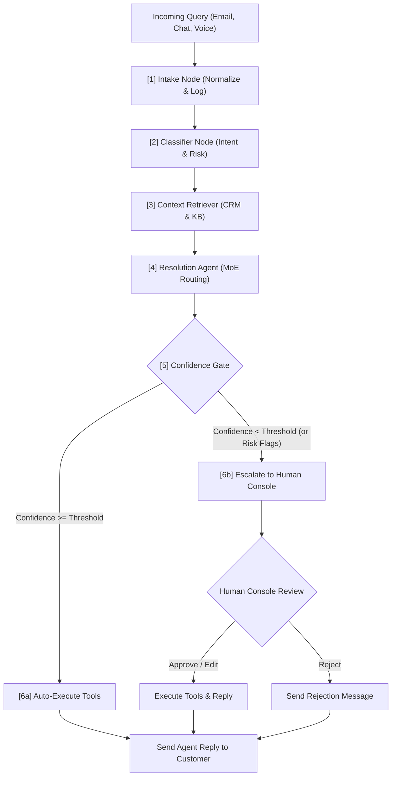
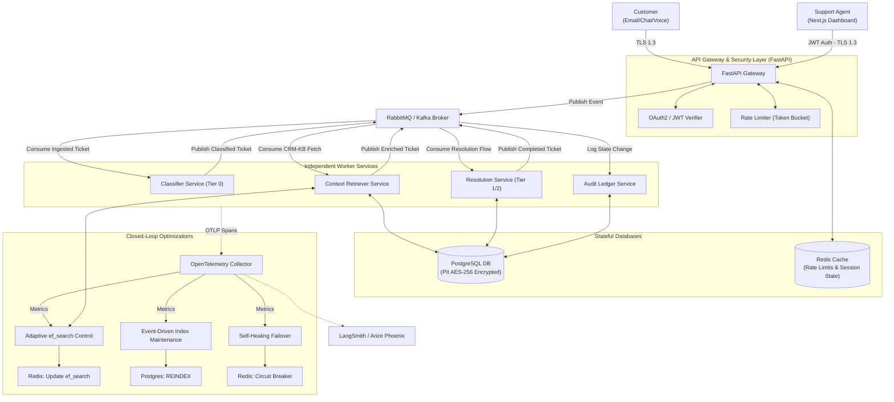

# AI Customer Support - Agent Dashboard

AI Customer Support is a multi-tier, Mixture-of-Experts (MoE) customer support automation system. It features a **LangGraph-powered agentic backend** and a **Next.js frontend dashboard** to manage autonomous resolutions, confidence gating, and human-in-the-loop escalations.

> [!IMPORTANT]
> **Product Requirements & Production Design:** For the complete, formal engineering requirements, CRISPE prompt engineering templates, security protocols (OAuth2/JWT, rate limiting, AES-256), and enterprise microservices decoupling specifications, please refer to the official **[Product Requirements Document (PRD.md)](file:///c:/Users/SHASHI/Desktop/ResolveAI/PRD.md)**.

---

## 🗺️ System Overview & Architecture

AI Customer Support handles incoming customer queries through multiple communication channels (Email, Live Chat, Voice), automatically resolving low-risk, high-confidence requests while escalating complex or high-risk cases to a human support agent dashboard.

### High-Level Execution Pipeline



---

### 🌐 Production Microservices & Closed-Loop Topology

The production deployment architecture features API Gateway security, event-driven microservices decoupling (via RabbitMQ/Kafka), database encryption (AES-256 for PII), and automated self-optimizing feedback loops (dynamic `ef_search` adaptation, automated re-indexing, and embedding failover circuit breakers):



---

## ⚙️ Core Technical Components

### 1. LangGraph State Machine Flow
The backend processing pipeline is modeled as a stateful graph using **LangGraph** (see [graph.py](file:///c:/Users/SHASHI/Desktop/AI%20Customer%20Support/backend/app/graph.py)).

*   **`intake_node`**: Registers the ticket and incoming customer message into the database and initializes the audit trace.
*   **`classify_node`**: Leverages a low-cost LLM to identify the customer's intent, extract key entities (such as order IDs or subscription IDs), and check for risk flags (angry language, legal threats, high refund amount).
*   **`context_retriever_node`**: Looks up the customer's CRM profile, including order history and subscriptions, and queries the local SQLite knowledge base for relevant FAQ articles.
*   **`resolve_node`**: Routes the request to the appropriate LLM tier based on intent and risk. The chosen LLM formulates a draft response and proposes system actions (like issuing refunds or cancelling subscriptions).
*   **`gate_node`**: Decides whether the resolution meets the confidence threshold. The threshold is intent-specific:
    *   `order_status`: `0.80`
    *   `refund_request`: `0.85`
    *   `shipping_delay`: `0.80`
    *   `subscription_cancel`: `0.90` (Strict escalation policy for user retention)
    *   `account_access`: `0.80`
    *   `general_faq`: `0.80`
*   **`execute_node`**:
    *   **Auto-Resolved**: Executes database actions (refunding orders or canceling subscriptions) automatically and replies directly.
    *   **Escalated**: Suspends automatic executions, sets the ticket status to `Escalated`, and packages the draft response and proposed actions to the Human Console.

---

### 2. Mixture-of-Experts (MoE) Model Routing
To optimize API costs and response latency, AI Customer Support uses a three-tier model routing hierarchy (see [llm.py](file:///c:/Users/SHASHI/Desktop/AI%20Customer%20Support/backend/app/llm.py)):

| Tier | Model Class | Cost (Input/Output per 1K) | Primary Use Cases |
| :--- | :--- | :--- | :--- |
| **Tier 0** | **Haiku-class (Cheap)** | \$0.00025 / \$0.00125 | Classification, General FAQs, simple queries |
| **Tier 1** | **Sonnet-class (Standard)** | \$0.00300 / \$0.01500 | Standard transactions (Order Status, low-value refunds, shipping delay) |
| **Tier 2** | **Opus-class (Frontier)** | \$0.01500 / \$0.07500 | High-risk scenarios (Legal threats, angry customers, high-value refunds, low classification confidence) |

---

### 3. Cryptographic Audit Ledger
For compliance, traceability, and safety, AI Customer Support implements a **cryptographic hash chain** to log agent decisions. Every state transition in the LangGraph writes an immutable block to the `audit_logs` database table.

The hash of each log entry is mathematically chained to the previous log entry's hash using SHA-256:

$$\text{Current Hash} = \text{SHA-256}(\text{prev\_hash} \mid \text{ticket\_id} \mid \text{node} \mid \text{input\_summary} \mid \text{model\_used} \mid \text{tokens} \mid \text{cost} \mid \text{confidence} \mid \text{action\_taken})$$

This creates a verifiable **audit trail** that ensures execution traces cannot be retroactively tampered with. If any record is modified, the hash verification chain breaks. The Next.js dashboard validates this chain in real-time, showing a green checkmark next to verified cryptographic logs.

---

### 4. Database Schema
The SQL database is powered by **SQLAlchemy** and **SQLite** (see [models.py](file:///c:/Users/SHASHI/Desktop/AI%20Customer%20Support/backend/app/models.py)).

*   **`Customer`**: Core customer information (name, email, phone).
*   **`Order`**: Tracks order statuses (`Shipped`, `Delivered`, `Refunded`, etc.), items bought, and tracking numbers.
*   **`Subscription`**: Active/cancelled plans for digital suites or cloud services.
*   **`KnowledgeBase`**: Knowledge articles categorized by FAQ, Shipping, and Refund topics.
*   **`Ticket`**: Support requests including channel (email, chat, voice), status (Open, Escalated, Resolved), confidence metrics, and accumulated token costs.
*   **`Message`**: Conversational records mapping to tickets.
*   **`AuditLog`**: Stores the cryptographic blocks (`hash` and `prev_hash`) for each agent decision step.

---

## 🖥️ Next.js Frontend Dashboard Features

The dashboard (see [page.tsx](file:///c:/Users/SHASHI/Desktop/AI%20Customer%20Support/frontend/src/app/page.tsx)) provides a simulator and console for testing and human verification:

1.  **Global Metrics Bar**: Displays real-time statistics including:
    *   **Trust Autonomy Rate**: Percentage of tickets resolved without human intervention.
    *   **Total Cost Saved**: Actual API token cost compared to a baseline where all queries are routed to Tier 2 (Opus).
    *   **Average Response Time**: Displays the contrast between 2-second autonomous replies and human-in-the-loop processing.
2.  **Channel Simulators**:
    *   **Email Simulator**: Allows custom query typing and displays step-by-step visual tracking of the LangGraph execution.
    *   **Voice Simulator**: Plays back text-to-speech style scripts (such as angry refund demands) and passes transcripts to the intake pipeline.
    *   **Live Chat Simulator**: Simulates a live chat widget where tickets remain open, updating dynamically once a human approves an escalation from the dashboard.
3.  **Human Console Interventions**:
    *   Shows a list of pending escalated tickets.
    *   Displays full customer profiles, transaction details, and order timelines alongside the query.
    *   Shows the exact system-drafted reply and proposed tools (e.g. `issue_refund` for \$120).
    *   Allows the human agent to **Approve** (runs the tools), **Edit** the message draft, or **Reject** the request.

---

## 🚀 Running the Project Locally

### 1. Backend Setup (FastAPI)
1.  Navigate to the backend folder:
    ```bash
    cd backend
    ```
2.  Activate the virtual environment:
    *   **Windows (PowerShell)**:
        ```powershell
        .\.venv\Scripts\Activate.ps1
        ```
    *   **macOS / Linux**:
        ```bash
        source .venv/bin/activate
        ```
3.  Install dependencies:
    ```bash
    pip install -r requirements.txt
    ```
4.  Seed the SQLite database with mock customers, orders, and knowledge articles:
    ```bash
    python seed.py
    ```
5.  Start the FastAPI Uvicorn server:
    ```bash
    python -m uvicorn app.main:app --reload --port 8000
    ```

### 2. Frontend Setup (Next.js)
1.  Navigate to the frontend folder:
    ```bash
    cd ../frontend
    ```
2.  Install dependencies:
    ```bash
    npm install
    ```
3.  Start the dev server:
    ```bash
    npm run dev
    ```
4.  Open your browser and navigate to [http://localhost:3000](http://localhost:3000).

### 3. Verify Integration & Crypto Chain
To run automated integration tests checking the routing logic, database updates, and cryptographic ledger chaining:
```bash
cd backend
python verify.py
```
